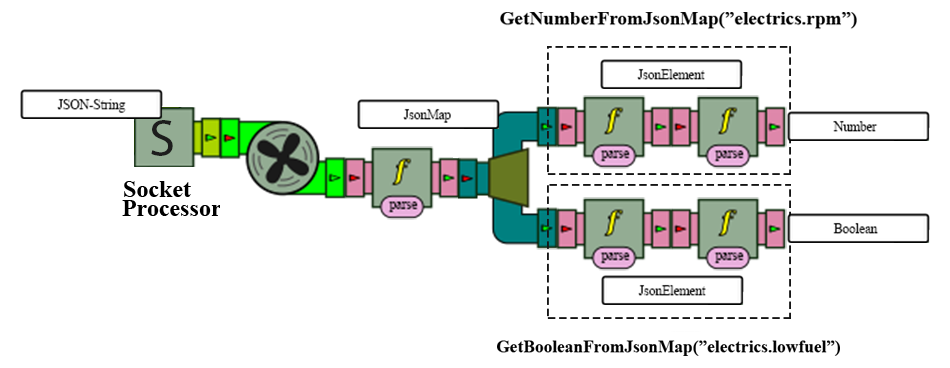

<h1>Brpc2022</h1>    

  <p>    
    Event Stream Processing with BeepBeep3 and BeamNG.    
    <br />    
    <a href="https://www.youtube.com/watch?v=g9Knivxg6CA">View Demo</a>     
  </p>  

<details>    
  <summary>Table of Contents</summary>    
  <ol>    
    <li><a href="#about-the-project">About The Project</a></li>    
    <li>    
      <a href="#getting-started">Getting Started</a>    
      <ul>    
       <li><a href="#note">Note</a></li>    
        <li><a href="#prerequisites">Prerequisites</a></li>    
        <li><a href="#beamngpy">BeamNGPy</a></li>    
        <li><a href="#ide-configuration">IDE Configuration</a></li>    
        <ul>    
          <li><a href="#intellij">IntelliJ</a></li>
          <li><a href="#python-module">Python module</a></li>    
        </ul>    
      </ul>    
    </li>    
    <li><a href="#usage">Usage</a></li>    
    <ul>    
      <li><a href="#write-your-own-scenario">Write your own scenario</a></li>    
      <li><a href="#start-your-own-scenario">Start your own scenario</a></li>    
      <ul>
        <li><a href="#server-side">Server side</a></li>    
        <li><a href="#client-side">Client side</a></li>    
      </ul>
      <li><a href="#the-vehicles-sensors">The vehicles' sensors</a></li>
      <li><a href="#beepbeep3s-starter-pack">BeepBeep 3's starter pack</a></li>
      <ul>
        <li><a href="#reading-incoming-packets">Reading incoming sockets</a></li>
        <li><a href="#getting-a-jsonmap-from-a-string">Getting a JsonMap from a String</a></li>
        <li><a href="#getting-a-property-from-a-jsonmap">Getting a property from a JsonMap</a></li>
        <li><a href="#grouping-processors">Grouping processors</a></li>
        <li><a href="#the-limits-of-beepbeep3">/!\ The limits of BeepBeep3 /!\</a></li>
      </ul>
    </ul>
    <li><a href="#contact-us">Contact us</a></li>    
  </ol>    
</details>    


<a id="about-the-project"></a>
# About The Project
This project consists in being a use case of BeepBeep 3's Event Stream Processing with BeamNG.

<a id="getting-started"></a>
# Getting Started

<a id="note"></a>
## Note
We highly suggest you to use [IntelliJ](https://www.jetbrains.com/idea/) with [Python plugin](https://plugins.jetbrains.com/plugin/631-python) if you want to use this in the most efficient way.

<a id="prerequisites"></a>
## Prerequisites
* Windows 10 (BeamNG doesn't seem to work on Linux)

* Latest version of [Python](https://www.python.org/downloads/)

* BeamNGPy package, just execute `pip install beamngpy` in your shell terminal

* BeamNG.tech license (_you can ask for yours [here](https://register.beamng.tech/)_)

<a id="beamngpy"></a>
## BeamNGPy
To use BeamNGPy library, you need to configure your workspace (the path where BeamNG is located),
- __Via Global environment variables__
  All you have to do is go to your global environment variables on your machine and create a new one called "BNG_HOME" that points to where you installed BeamNG.
- __Via Python__
  Open a terminal and type:
  ```
  beamngpy --work-space <PATH-TO-BEAMNG>
  ``` 
  and Voilà !


<a id="ide-configuration"></a>
## IDE Configuration

<a id="intellij"></a>
### IntelliJ
You simply have to clone the repo, open the folder in Intellij and wait for gradle to finish building. You're almost done.

<a id="python-module"></a>
#### Python module
Intellij has a wonderful Python plugin which includes a nice workflow (instead of using PyCharm, you now use only one IDE). To set this up, follow the instructions below:

1. Open Project Structure : File > Project structure ...
2. Go to Project settings > Modules section
3. Select "+" sign and choose "Import module"
4. Select "src/python" folder
5. Select "Create module from existing sources"
6. Be sure to have checked the checkbox with the absolute path to the python folder you selected
7. Select "+" sign and "Add new Python SDK"
8. Choose a location, we suggest you to choose `...\src\main\python\venv`, check _Inherit global site-packages_
9. Django framework is detected, uncheck if you don't want to use it in the project (we don't use it, so we suggest you to uncheck it), and click __Create__    
   Now the python folder is considered as a Python module, but you have to select the SDK that you created just before for the python module, apply and everything is good to go. We propose you to restart your IDE and now normally everything should be set up correctly.


<a id="usage"></a>
# Usage

With BeamNGPy, you can write your own customizable scenario, here are some [example](https://github.com/BeamNG/BeamNGpy/blob/dev/examples/guide.md) to illustrate what you can do with BeamNGPy.

What we have done here is that a listener will execute the scenario that you have written, and will get all the data from the current vehicles that you created during the simulation with a given duration.

<a id="write-your-own-scenario"></a>
## Write your own scenario
We have made a scenario template, in ``main/python/src/utils/scenario`` called ``scenario_example.py``. The most important method here is the ``run`` function.  Here's an example of what should be written in here:

```py
cls.beamng_instance = BeamNGpy('localhost', 64256)  # This is the host & port used to communicate over  
cls.beamng_instance.open()  

# Create a vehile instance that will be called 'ego' in the simulation  
# using the etk800 model the simulator ships with  
vehicle_1 = Vehicle('ego', model='etk800', licence='PYTHON', colour='Green') 
# Create an Electrics sensor and attach it to the vehicle  
electrics = Electrics()  
vehicle_1.attach_sensor('electrics', electrics)  
damage = Damage()  
vehicle_1.attach_sensor('damage', damage)  
  
# Create a scenario called vehicle_state taking p   lace in the west_coast_usa map the simulator ships with  
cls.scenario = Scenario('west_coast_usa', 'vehicle_state')  
# Add the vehicle and specify that it should start at a certain position and orientation.  
# The position & orientation values were obtained by opening the level in the simulator,  
# hitting F11 to open the editor and look for a spot to spawn and simply noting down the  
# corresponding values.  
cls.scenario.add_vehicle(vehicle_1, pos=(-717.121, 101, 118.675),  
  rot=(0, 0, 45))  # 45 degree rotation around the z-axis  
  
# Really important !  
cls.scenario.make(cls.beamng_instance)  
cls.beamng_instance.load_scenario(cls.scenario)  
  
# enable auto driving by an AI on vehicle_1  
vehicle_1.ai_set_mode('span')
``` 
This is pretty similar to what you can see on [BeamNGPy example](https://github.com/BeamNG/BeamNGpy#usage), but you really need to be careful with that ``cls`` keyword and these 2 two lines
```py
cls.scenario.make(cls.beamng_instance)  
cls.beamng_instance.load_scenario(cls.scenario)  
```
Otherwise, nothing will work.


<a id="start-your-own-scenario"></a>
## Start your own scenario

<a id="server-side"></a>
### Server side
First of all, you need to start the Server, for that you have two options:

- __Using the command line__
  Really simple, all you have to do is open a terminal in the root of the project, and type:
  ```
  .\gradlew.bat run --args="8080 100"
  ```
  That command will simply run the server on the port 8080 with 100 milliseconds of delay to retrieve data that has been sent.

- __Using the IDE (IntelliJ)__
  Open ``Run/Debug Configuration`` (just beside the green play button, add new configuration by choosing Gradle, choose the brpc2022 folder and simply write in task category `run --args="8080 100"`. For more inside, have a look at [IntelliJ documentation](https://www.jetbrains.com/help/idea/run-debug-gradle.html).

The server is now running and waiting for a connection.

<a id="client-side"></a>
### Client side
To start your scenario, you will have to use the script ``listener.py`` present in ``main/python/src``. You can use the option ``--help`` to know what parameters you can give:
```
$> py listener.py --help

$> usage: listener.py [-h] [--debug] [--time TIME] [--delay DELAY] [--port PORT]  
[--output OUTPUT] scenario  
  
Listen to a BeamNG scenario given.  
  
positional arguments:  
	scenario BeamNG scenario that you want to listen  
  
optional arguments:  
	-h, --help show this help message and exit,  
	--debug Activate debug output,
	--time TIME Number of snapshots wanted per seconds (default is 60),  
	--delay DELAY Delay of transmitting the snapshots in milliseconds (default is 100),  
	--port PORT (default is 8080),  
	--output OUTPUT Create a folder containing all jsons data for all vehicles.  
	(optional)
```
So,
```
py listener.py --debug --time 60 --delay 100 -- port 8080 --output samples scenario_example
```
will start the scenario_example present in the ``src/utils/scenario`` package, connected to the local server, on the port 8080, with debug log enabled, with 60 snapshots in total with a delay of 100 milliseconds and all snapshots will be saved in one json file located in ``src/samples``, with the following name format: ``carId_Day_Month_Year-Hours_Minutes_Seconds.json``

Example of what the json looks like in this case:
```json
{
	"0" : {........},
	................
	"59" : {........}
}
```

<a id="the-vehicles-sensors"></a>
## The vehicles' sensors
In order to analyze the vehicles' data, you'll have to know what you're looking for first.  
Each vehicle has its own set of sensors, producing values that we will call "properties" from now on. These properties may change during the simulation.

You can find a list of existing properties related to a vehicle's state [here](https://github.com/BeamNG/BeamNGpy/blob/0f25ee8d047e787240fa624ddfa3f9d54addf0ca/src/beamngpy/vehicle.py#L116-L133), and most importantly the "electrics" properties [here](https://github.com/BeamNG/BeamNGpy/blob/3009c6f80045f05ca78a376d7c4d0bcf416e9316/src/beamngpy/sensors.py#L978-L1050).
These are the values that the json sent through sockets will contain. You will find below a tutorial on how to use BeepBeep to interpret them.

<a id="beepbeep3s-starter-pack"></a>
## BeepBeep 3's starter pack

Assuming you're done with setting up the project and with sending the sockets from the client, you will now learn how to read and interpret a vehicle's properties by using BeepBeep.

First of all, you may want to check out BeepBeep's official resources, including:  its [website](http://liflab.github.io/beepbeep-3/), its [official documentation](https://liflab.gitbook.io/event-stream-processing-with-beepbeep-3/)  and its [API javadoc](https://liflab.github.io/beepbeep-3/javadoc/index.html).

<a id="reading-incoming-packets"></a>
### Reading incoming sockets
If you haven't already, please have a look at the [Processors' documentation](https://liflab.gitbook.io/event-stream-processing-with-beepbeep-3/basic#processors).

To read incoming sockets, you will have to create a new [Source](https://liflab.gitbook.io/event-stream-processing-with-beepbeep-3/dictionary#source) object (since it has no input stream), which we called "SocketReader" (you can find the code [here](https://github.com/Siirko/brpc2022/blob/main/src/main/java/beepbeep/processors/SocketReader.java)), with an output arity of 1.  
Then, you'll have to override its compute() method, and add the JSON you've just read, as a string, to the outputs Queue object.  
If no data is available, this means that the simulation has ended and that the server should be closed.

Now, you have a processor which **COULD** read the sockets, get the JSON-string and transfer it to the next processor in the chain, **if another processor asks it to**.  
The problem is that no one does.

<a id="getting-a-jsonmap-from-a-string"></a>
### Getting a JsonMap from a String
What you'll have to do now, is to set up a [Pump](https://liflab.gitbook.io/event-stream-processing-with-beepbeep-3/advanced#pumps-and-tanks) processor, which will request the current JSON-string to the SocketReader you just set up, with a constant delay which should preferably be the same as the one with which you're sending the sockets. When the pump gets the requested string, it will push it until the end of the processors' chain.

The pump being in place, you will be able to retrieve a String. But, what you want is to get a specific property.  
To do that, you will want to parse the String as a JsonMap (we used the [JSON library](https://liflab.gitbook.io/event-stream-processing-with-beepbeep-3/palettes#json-parsing) that the LIF made, so the JsonMap is basically a HashMap), using an [ApplyFunction]([ApplyFunction](https://liflab.gitbook.io/event-stream-processing-with-beepbeep-3/core#applying-a-function-on-a-stream)) (which is a descendant of the Processor class).

An ApplyFunction needs to be given a function (which will return an output based on an input). Since the function only needs one input, it will extend the [UnaryFunction](https://liflab.gitbook.io/event-stream-processing-with-beepbeep-3/custom#unary-and-binary-functions) class.  
In our case, the function takes a String as input and returns a JsonElement (which is a superclass of JsonMap, and which could also represent a property).  
We now have our JsonMap object.

<a id="getting-a-property-from-a-jsonmap"></a>
### Getting a property from a JsonMap
Imagine you want to get many properties, and process them differently.  
For example, let's say you want to get the "wheelspeed" property, which is a number, and the "lowfuel" property, which is a boolean (both of them are in the "electrics" sensors).

Since the JSON-string of a vehicle stores all the vehicle's properties, you don't want to parse the string as a map many times. So you will just use the map as an input to 2 different chains of processors.  
To do that, you'll have to use a [Fork](https://liflab.gitbook.io/event-stream-processing-with-beepbeep-3/core#forking-a-stream) processor, with an output arity of 2 (this will depend on the number of properties you want to analyze).  
Now, you have two outputs with the same JsonMap that you can treat differently.

<a id="grouping-processors"></a>
#### Grouping processors
First, have a look at [BeepBeep's grouping processors documentation](https://liflab.gitbook.io/event-stream-processing-with-beepbeep-3/core#grouping-processors).  We coded three main groups of processors, the first one being [GetBooleanFromJsonMap](https://github.com/Siirko/brpc2022/blob/main/src/main/java/beepbeep/processors/groupprocessors/basics/GetBooleanFromJsonMap.java), the second one being [GetNumberFromJsonMap](https://github.com/Siirko/brpc2022/blob/main/src/main/java/beepbeep/processors/groupprocessors/basics/GetNumberFromJsonMap.java) and the last one being [GetStringFromJsonMap](https://github.com/Siirko/brpc2022/blob/main/src/main/java/beepbeep/processors/groupprocessors/basics/GetStringFromJsonMap.java) (this one isn't used at the moment since the sensors only return numbers/booleans, and consequently has not been tested).  
These will allow you to get a property, depending on its type (whether it's a boolean/number/string), directly from the JsonElement representing the map.  
How they work is: you give them the path of the property (in the json map), it parses the element (the same way we did to parse the string to a map, except we changed the parameter function given to our ApplyFunction) to what you want and returns its value.

You can now connect each of your fork's outputs to the input of the group of processors you want to use, and get the value of the property as its output.  

Here, it would be something like
```java 
GroupProcessor getRpm = new GetNumberFromJsonMap("electrics.rpm");  
GroupProcessor getLowFuel = new GetBooleanFromJsonMap("electrics.lowfuel");  
Connector.connect(fork, 0, getRpm, 0);  
Connector.connect(fork, 1, getLowFuel, 0);  
```  

Here is a global view of this example:


We coded a few groups of processors, for example [GetMinValueFromJsonMap()](https://github.com/Siirko/brpc2022/blob/main/src/main/java/beepbeep/processors/groupprocessors/processing/number/GetMinValueFromJsonMap.java) and [GetMaxValueFromJsonMap()](https://github.com/Siirko/brpc2022/blob/main/src/main/java/beepbeep/processors/groupprocessors/processing/number/GetMaxValueFromJsonMap.java) which both return a Number.

Now, feel free to create your own chains of processors to store or process your properties.

<a id="the-limits-of-beepbeep3"></a>
### ⚠️ The limits of BeepBeep3 ⚠️
While we were working on this project, we noticed that a BeamNG scenario can contain several vehicles.
However, you will not be able to use BeepBeep to analyze the properties of many vehicles at the same time, or at least not "properly".
BeepBeep was created and coded in a way that doesn't allow multithreading (we think the use of singletons in the processors functions is the main issue).

This means that if you would like to use 2 cars in a scenario, you couldn't analyze each car's properties in its own thread containing a chain of processors.
You would have to use the main thread and sort the cars yourself, by giving them an identifier in the JSON-string.

The current code should allow you to use multithreading in the event of a full rewrite of BeepBeep, but for now we strongly advise you to use a single car in your scenarios.

<a id="contact-us"></a>
# Contact us

_Alexander Yanovskyy_ - contact@yanovskyy.com    
_Baptiste Wetterwald_ - [Github](https://github.com/BaptisteWetterwald)